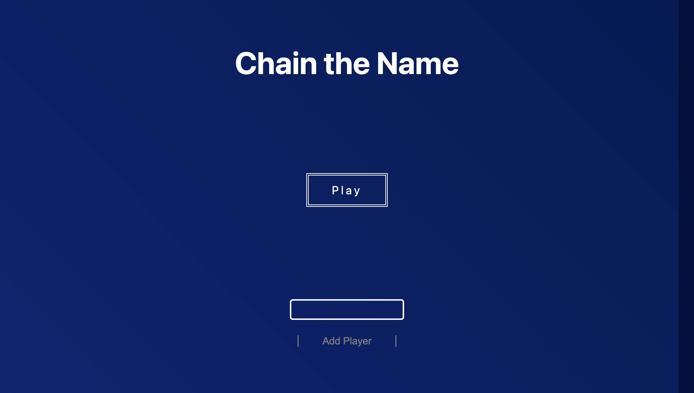
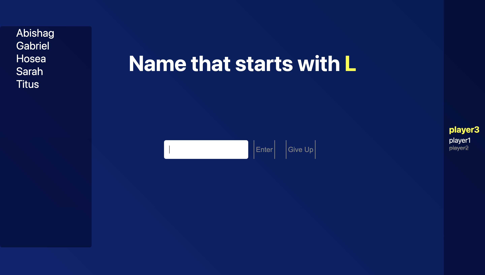
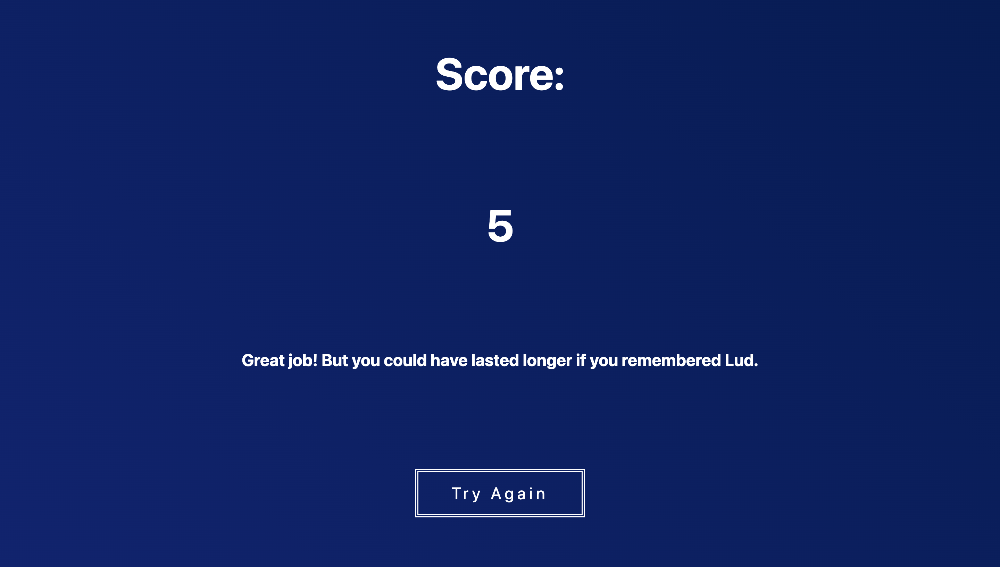

# Chain the Name

## What is this?

This is a simple Bible name game.

## Oh, it's a game! Cool. How do you play it?

After entering all the players' names, the game selects a letter at random. The player now have to type in a name of a Bible character that begins with that letter. The catch is that player needs to select their name wisely, because whatever is the last letter of that name becomes the first letter for the next name.

For example, if player 1 has to enter a name that begins with "J", and that player enters "Jacob", the next player has to enter a name that starts with "B", for example, "Benjamin".

Previously entered names will appear alphabetically sorted on the left side of the screen, and active players will appear on the right side.

The game ends when all the players can no longer recall names to enter and have skipped their turn. At that point, the total length of the name chain is displayed at the end. This screen will also reveal a name that could have continued the chain.

## What was used to make this game?

This was my first venture into TypeScript and NextJS, so those are the only two main technologies I used for this. Honestly, my code might be sloppy, but I'll be refactoring this quite a few times as I learn more best practices for TypeScript and NextJS. Stay tuned for that.

## Where did you find the names to use for the name database? Will it be updated in the future?

I read a lot... The database will definitely be updated if I find names I missed.

## Anything else you plan on updating in the future?

I will clean up the interface to make it more visually appealing. A mobile view is in the works as well. There's also a possibility of this becoming a multiplayer game in the style of Jackbox games, using rooms to join so everyone can make their entries from their own devices.

## Enough talk. How do I run this?

After navigating to the folder and installing the dependencies with npm, just enter **yarn dev** and then open your browser and go to **localhost://3000**. Have fun!
